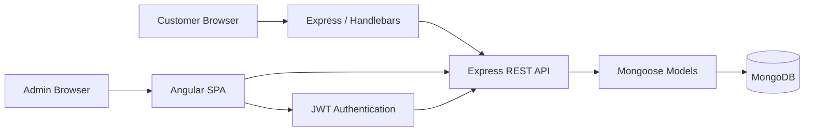

<div align="center">

# Travlr Getaways
### CS 465 · Full Stack Development Portfolio

**Madison Parker · Southern New Hampshire University**


*A full-stack travel application developed incrementally from a customer-facing Express site into a MongoDB-backed API and authenticated Angular administrative SPA.*

</div>

---

## Project at a Glance

Travlr Getaways is my final project for **SNHU CS 465: Full Stack Development**. The application demonstrates the progression from a traditional server-rendered website to a complete MEAN-stack solution using **MongoDB, Express, Angular, and Node.js**.

The public side presents travel packages through Express and Handlebars. The administrative side is an Angular single-page application that reads and manages the same trip data through a RESTful API. The final iteration adds registration, login, JSON Web Token authentication, and server-side protection for data-changing endpoints.

### Final capabilities

- Express MVC customer-facing website
- Handlebars templates and reusable partials
- JSON-driven trip rendering
- MongoDB persistence through Mongoose models and schemas
- RESTful GET, POST, PUT, and DELETE endpoints
- Angular administrator SPA with reusable components and services
- Add, edit, and delete trip workflows
- Passport-based user authentication
- PBKDF2 salted password hashing
- JWT authentication with protected administrative write routes
- Postman endpoint and security verification

---

## Application Preview

| Authenticated Admin SPA | Final Trip Administration |
|---|---|
|  |  |

| Login | Verified Update |
|---|---|
|  |  |

> The screenshots in this repository are the original local testing evidence from the completed application. They have not been recreated or cosmetically altered.

---

## Architecture



The two frontends serve different purposes while sharing the same backend data. The Express application is appropriate for the public customer experience because the server renders the Handlebars views. The Angular SPA provides a more interactive administrative workflow where components can update application state without rebuilding an entire page for every action.

MongoDB fits the project because trip records map naturally to document-based data and pass cleanly through the application as JSON. Mongoose adds schema validation and a consistent model layer between the API and database.

---

## Security Verification

Module Seven added the final authentication layer and tested both successful and rejected requests.

| Test | Expected result | Verified result |
|---|---:|---:|
| Register mock administrator | JWT returned | **200 OK** |
| Administrator login | JWT returned | **200 OK** |
| Protected POST without token | Request rejected | **401 Unauthorized** |
| Protected POST with JWT | Trip created | **201 Created** |
| Authenticated SPA update | Trip changed | **Successful** |
| Protected DELETE with JWT | Test trip removed | **200 OK** |

The important security behavior is enforced on the server, not only in the user interface. Public GET routes remain available for displaying trip information, while POST, PUT, and DELETE operations require a valid Bearer token.

---

## API Summary

### Public endpoints

```text
GET    /api/trips
GET    /api/trips/:tripCode
POST   /api/register
POST   /api/login
```

### Authenticated administrator endpoints

```text
POST   /api/trips
PUT    /api/trips/:tripCode
DELETE /api/trips/:tripCode
```

Protected requests use:

```text
Authorization: Bearer <JWT>
```

---

## Repository Branches

The branch history mirrors the major stages of the course so the application can be reviewed as an evolving project rather than only as a finished submission.

| Branch | Course development stage |
|---|---|
| `module1` | Node.js/Express foundation and static customer website |
| `module2` | MVC routing, controllers, Handlebars views, and partials |
| `module3` | JSON-driven trip data and reusable rendering |
| `module4` | MongoDB, Mongoose schema, connection, and database seeding |
| `module5` | RESTful API integration and API-backed trip data |
| `module6` | Angular administrator SPA, services, components, and CRUD |
| `module7` | Registration, login, Passport, JWT, and protected endpoints |
| `final` | Final portfolio version, documentation, and reflection |

---

## Running the Final Project Locally

### Requirements

- Node.js and npm
- MongoDB running locally
- Angular CLI for the administrator SPA

### 1. Install and start the Express/API application

```bash
npm install
npm run seed
npm start
```

### 2. Start the Angular administrator SPA

In a second terminal:

```bash
cd app_admin
npm install
npm start
```

### 3. Open the applications

```text
Public site:   http://localhost:3000/travel
Admin SPA:     http://localhost:4200
```

The real `.env` file is intentionally excluded from version control. Copy `.env.example` to `.env` and provide a local JWT secret before testing authentication.

---

## Testing

The `postman/` directory contains collections used during development to verify the API and the Module Seven security workflow. The `screenshots/` directory contains the resulting evidence used in the final software design documentation.

The final security sequence verified that unauthenticated write access is rejected while the same operation succeeds after login with a valid token. The test trip was then updated through the Angular SPA and removed through the authenticated DELETE endpoint, returning the database to the original three seeded trips.

---

## Course Reflection

This project was useful because each module changed the architecture in a way that made the previous work easier to understand. I started with the visible webpage, then separated routes and views, moved data into MongoDB, exposed that data through an API, built an Angular client around the API, and finally secured administrative changes.

The largest improvement in my full-stack development skills was learning to trace one feature through every layer. When an operation failed, I learned to check the component, service, request, route, controller, model, database, and server response instead of treating the frontend and backend as separate problems. Testing with Postman also made HTTP methods and status codes much more concrete because I could verify the API independently before relying on the interface.

The final application represents my work with **application architecture, frameworks, database integration, REST APIs, reusable UI components, authentication, security testing, and Git branch management** throughout CS 465.

---

## Portfolio Documentation

Final course documents are stored in `docs/`, including the completed Software Design Document and Module Eight reflection. Development notes and testing evidence remain in the project so the decisions behind the final implementation are reviewable.

<div align="center">

**Madison Parker · CS 465 · Full Stack Development**

</div>
