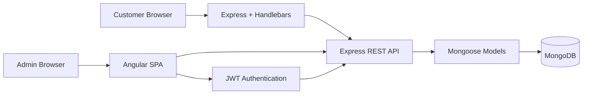

<div align="center">

# ✈️ Travlr Getaways
### CS 465 · Full Stack Development Portfolio

**Madison Parker · Southern New Hampshire University**


*A customer-facing travel website and authenticated administrator SPA built across CS 465 using MongoDB, Express, Angular, and Node.js.*

</div>

---

## Portfolio Overview

Travlr Getaways is my final project for **SNHU CS 465: Full Stack Development**. I developed the application in layers throughout the course, beginning with a static customer-facing Express site and progressively adding MVC organization, Handlebars templates, MongoDB persistence, a RESTful API, an Angular administrative SPA, CRUD operations, and JWT-based security.

The final application has two frontends with different responsibilities:

| Experience | Technology | Purpose |
|---|---|---|
| **Customer site** | Express + Handlebars | Presents travel content and trip packages through server-rendered views |
| **Administrator site** | Angular SPA | Allows authenticated administrators to add, edit, and delete trip records |
| **Shared backend** | Express REST API + Mongoose | Connects both interfaces to the MongoDB trip data |

### What the completed project demonstrates

- Express MVC architecture with routes, controllers, views, and partials
- Dynamic Handlebars rendering instead of duplicated static trip markup
- MongoDB persistence using Mongoose schemas and models
- Repeatable database seeding for local development and testing
- RESTful GET, POST, PUT, and DELETE endpoints
- Angular components, routing, services, and reusable trip cards
- Administrator add, edit, and delete workflows
- Passport-based authentication and PBKDF2 password hashing
- JSON Web Tokens for authenticated requests
- Server-side protection of administrative write endpoints
- Postman testing of both successful and rejected API requests
- Git branches organized around the major course checkpoints

---

## Architecture



The customer-facing side uses server-rendered Handlebars views, which works well for a traditional public website. The administrator side uses Angular because the SPA benefits from reusable components and client-side routing while managing database records. Both interfaces depend on the same Express API and MongoDB data instead of maintaining separate data sources.

---

## Code Tour

| Area | Key files |
|---|---|
| Express application setup | [`app.js`](app.js), [`bin/www`](bin/www) |
| Customer MVC routes/controllers | [`app_server/`](app_server/) |
| Handlebars views and partials | [`app_server/views/`](app_server/views/) |
| MongoDB models and seed process | [`app_api/models/`](app_api/models/) |
| REST API controllers/routes | [`app_api/controllers/`](app_api/controllers/), [`app_api/routes/`](app_api/routes/) |
| Angular administrator SPA | [`app_admin/src/app/`](app_admin/src/app/) |
| Authentication service | [`authentication.service.ts`](app_admin/src/app/services/authentication.service.ts) |
| JWT request interceptor | [`jwt.interceptor.ts`](app_admin/src/app/utils/jwt.interceptor.ts) |
| API verification | [`postman/`](postman/) |
| Module Eight reflection | [`docs/MODULE8_JOURNAL_MADISON_PARKER.md`](docs/MODULE8_JOURNAL_MADISON_PARKER.md) |

---

## Security

Module Seven added the final security layer. The administrator can register or log in to obtain a JWT, and Angular attaches the Bearer token to authenticated requests. The backend independently verifies that token before any request is allowed to change trip data.

### Final verification results

| Test | Result |
|---|---:|
| Register mock administrator | **200 OK + JWT** |
| Administrator login | **200 OK + JWT** |
| Protected POST without token | **401 Unauthorized** |
| Protected POST with valid JWT | **201 Created** |
| Authenticated Angular update | **Successful** |
| Protected DELETE with valid JWT | **200 OK** |

This distinction was important during testing: hiding Add/Edit/Delete buttons in Angular improves the interface, but **server-side authorization is what actually protects the data**.

### Public endpoints

```text
GET    /api/trips
GET    /api/trips/:tripCode
POST   /api/register
POST   /api/login
```

### Protected administrator endpoints

```text
POST   /api/trips
PUT    /api/trips/:tripCode
DELETE /api/trips/:tripCode
```

Protected requests require:

```text
Authorization: Bearer <JWT>
```

---

## Branch Organization

The repository includes the course branches requested for the portfolio workflow. The **main** and **final** branches contain the authoritative completed application.

| Branch | Course focus |
|---|---|
| `module1` | Node.js/Express foundation and customer-facing website |
| `module2` | MVC routes, controllers, Handlebars views, and partials |
| `module3` | JSON-driven dynamic trip rendering |
| `module4` | MongoDB, Mongoose, connection, and seed process |
| `module5` | REST API integration |
| `module6` | Angular administrator SPA and CRUD |
| `module7` | Login, Passport, JWT authentication, and protected endpoints |
| `final` | Completed portfolio baseline |

---

## Running the Project

### Requirements

- Node.js and npm
- MongoDB running locally
- Angular CLI

### Express / API server

```bash
npm install
npm run seed
npm start
```

### Angular administrator SPA

Open a second terminal:

```bash
cd app_admin
npm install
npm start
```

Then open:

```text
Customer site: http://localhost:3000/travel
Admin SPA:     http://localhost:4200
```

### Environment configuration

The real `.env` file is intentionally excluded from GitHub. Create a local `.env` from `.env.example` and supply a private JWT secret before testing authentication.

```text
JWT_SECRET=replace-with-a-local-secret
```

No production or personal secret is stored in this repository.

---

## Testing Approach

I tested the REST API separately from the Angular interface so I could determine whether a failure came from the backend or the frontend. The Postman collections in [`postman/`](postman/) cover the API progression from trip retrieval through the final authenticated security sequence.

The final Module Seven test intentionally compared the same protected operation in two states: without a token the server returned **401**, and after login the authenticated request returned **201**. I then used the Angular SPA to update the test trip and finished by deleting it through the protected API, leaving the database with the original three seeded trip records.

---

## Module Eight Reflection

The complete journal reflection is included in [`docs/MODULE8_JOURNAL_MADISON_PARKER.md`](docs/MODULE8_JOURNAL_MADISON_PARKER.md).

The biggest change in how I approached full-stack development was learning to follow one feature through every layer. Instead of treating the browser, API, and database as separate assignments, I became more comfortable tracing a request through the Angular component and service, HTTP request, Express route, controller, Mongoose model, MongoDB database, and response. That process made debugging more structured and made the purpose of the MEAN architecture much clearer to me.

---

## Skills Demonstrated

`MongoDB` · `Mongoose` · `Express` · `Node.js` · `Angular` · `TypeScript` · `JavaScript` · `Handlebars` · `REST APIs` · `JSON` · `CRUD` · `Passport` · `JWT` · `Postman` · `Git`

<div align="center">

---

**Madison Parker**  
**SNHU · CS 465 Full Stack Development**

</div>
