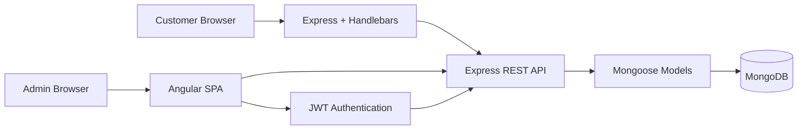

<div align="center">

# ✈️ Travlr Getaways
### CS 465 · Full Stack Development Portfolio

**Madison Parker · Southern New Hampshire University**


*A customer-facing travel website and authenticated administrator SPA built throughout CS 465 using MongoDB, Express, Angular, and Node.js.*

</div>

---

## Portfolio Overview

Travlr Getaways is my final project for **SNHU CS 465: Full Stack Development**. I developed the application in layers throughout the course, beginning with the supplied customer-facing website and progressively adding Express MVC organization, Handlebars templates, MongoDB persistence, a RESTful API, an Angular administrative SPA, CRUD functionality, and JWT-based authentication.

The completed application has two frontends with different responsibilities while sharing one backend data source:

| Experience | Technology | Purpose |
|---|---|---|
| **Customer site** | Express + Handlebars | Presents travel content and trip packages through server-rendered views |
| **Administrator site** | Angular SPA | Allows authenticated administrators to add, edit, and delete trip records |
| **Shared backend** | Express REST API + Mongoose | Connects both interfaces to MongoDB trip data |

### Final capabilities

- Express MVC architecture with routes, controllers, views, and partials
- Dynamic Handlebars trip rendering instead of duplicated static markup
- MongoDB persistence using Mongoose schemas and models
- RESTful GET, POST, PUT, and DELETE endpoints
- Angular components, routing, services, reactive forms, and reusable trip cards
- Administrator add, edit, and delete workflows
- Local user authentication through Passport
- Salted PBKDF2 password hashing
- JSON Web Tokens for authenticated requests
- Server-side protection of administrative write endpoints
- Postman testing of both successful and rejected API requests
- Git branches organized around the major course checkpoints

---

## Final Project Rubric Alignment

| Project requirement | Implementation in this repository |
|---|---|
| **Customer-Facing Website** | Express serves the public Travlr site and travel package content |
| **MVC Routing** | `app_server/routes`, `app_server/controllers`, and `app_server/views` separate routing, logic, and presentation |
| **Static HTML to Templates With JSON** | Handlebars templates render trip data dynamically rather than repeating static trip cards |
| **NoSQL Database** | MongoDB stores trip and user documents through Mongoose schemas/models |
| **RESTful API** | `app_api/routes` and `app_api/controllers` implement trip retrieval and CRUD operations |
| **SPA** | `app_admin` contains the Angular administrator interface with components and services |
| **Security** | Login returns a JWT and the server independently requires a valid Bearer token for POST, PUT, and DELETE operations |

---

## Architecture



The customer-facing side uses server-rendered Handlebars views, which fits a traditional public website. The administrator side uses Angular because the SPA benefits from reusable components, services, forms, and client-side routing while maintaining trip records. Both interfaces work with the same API and MongoDB data instead of maintaining separate copies of the trip information.

---

## Code Tour

| Area | Key files |
|---|---|
| Express application setup | [`app.js`](app.js), [`bin/www`](bin/www) |
| Customer MVC routes/controllers | [`app_server/`](app_server/) |
| Handlebars views and partials | [`app_server/views/`](app_server/views/) |
| MongoDB models and seed process | [`app_api/models/`](app_api/models/) |
| REST API controllers/routes | [`app_api/controllers/`](app_api/controllers/), [`app_api/routes/`](app_api/routes/) |
| Angular administrator SPA | [`app_admin/src/app/`](app_admin/src/app/) |
| Authentication service | [`authentication.service.ts`](app_admin/src/app/services/authentication.service.ts) |
| JWT request interceptor | [`jwt.interceptor.ts`](app_admin/src/app/utils/jwt.interceptor.ts) |
| API verification | [`postman/`](postman/) |
| Security testing notes | [`docs/SECURITY_TESTING.md`](docs/SECURITY_TESTING.md) |
| Module Eight reflection | [`docs/MODULE8_JOURNAL_MADISON_PARKER.md`](docs/MODULE8_JOURNAL_MADISON_PARKER.md) |

---

## Security and Repository Protection

Module Seven added the final authentication layer. The administrator login returns a JWT, Angular attaches that token to authenticated requests, and the Express API independently verifies the Bearer token before allowing trip data to be changed.

The repository is intentionally configured so that local credentials are not published:

- `.env` is ignored by Git and is not stored in the public repository.
- `.env.example` contains placeholders only.
- The Postman email and password are **mock localhost test values**, not personal or production credentials.
- The token collection variable begins empty and is populated only after a successful local registration or login.
- Add and Edit forms redirect to login when opened without an active token, while the server remains the actual authorization boundary.

### Final verification results

| Test | Verified result |
|---|---:|
| Register mock administrator | **200 OK + JWT** |
| Administrator login | **200 OK + JWT** |
| Protected POST without token | **401 Unauthorized** |
| Protected POST with valid JWT | **201 Created** |
| Authenticated Angular update | **Successful** |
| Protected DELETE with valid JWT | **200 OK** |

The 401 test was especially important because hiding Add/Edit/Delete buttons in Angular is not enough to protect data. A direct unauthenticated API request is still rejected by the server.

### Public endpoints

```text
GET    /api/trips
GET    /api/trips/:tripCode
POST   /api/register
POST   /api/login
```

### Protected administrator endpoints

```text
POST   /api/trips
PUT    /api/trips/:tripCode
DELETE /api/trips/:tripCode
```

Protected requests require:

```text
Authorization: Bearer <JWT>
```

> This repository demonstrates the security layer required for the CS 465 project. The registration endpoint and browser token storage are appropriate for the course testing workflow; a production deployment would normally add stricter administrator provisioning, HTTPS-only deployment controls, rate limiting, and additional operational security.

---

## Branch Organization

The repository includes the course branches used to mark the major development checkpoints. The **main** and **final** branches contain the authoritative completed portfolio.

| Branch | Course focus |
|---|---|
| `module1` | Node.js/Express foundation and customer-facing website |
| `module2` | MVC routes, controllers, Handlebars views, and partials |
| `module3` | JSON-driven dynamic trip rendering |
| `module4` | MongoDB, Mongoose, connection, and seed process |
| `module5` | REST API integration |
| `module6` | Angular administrator SPA and CRUD |
| `module7` | Login, Passport, JWT authentication, and protected endpoints |
| `final` | Completed portfolio baseline |

---

## Running the Project

### Requirements

- Node.js and npm
- MongoDB running locally
- Angular CLI

### 1. Configure the local environment

Copy `.env.example` to `.env` and replace the JWT placeholder with a private local value.

```text
DB_HOST=127.0.0.1
JWT_SECRET=replace-with-a-long-random-development-secret
```

### 2. Start the Express / API server

```bash
npm install
npm run seed
npm start
```

### 3. Start the Angular administrator SPA

Open a second terminal:

```bash
cd app_admin
npm install
npm start
```

Then open:

```text
Customer site: http://localhost:3000/travel
Admin SPA:     http://localhost:4200
```

---

# Module Eight Journal Reflection

The following sections answer the Module Eight portfolio prompts directly. A matching standalone reflection is also available in [`docs/MODULE8_JOURNAL_MADISON_PARKER.md`](docs/MODULE8_JOURNAL_MADISON_PARKER.md).

## Architecture

I used two different frontend approaches in the project. The customer-facing site began with HTML, CSS, and JavaScript and was then organized through Express using MVC routing and Handlebars templates. Express renders the customer pages on the server, so moving between pages follows a traditional request-and-response pattern. The administrator side was built as an Angular single-page application. The SPA uses components, services, forms, and client-side routing so an administrator can work with trip data without rebuilding an entire page for every interaction. Using both approaches helped me see the difference between a server-rendered website and a component-based client application.

The backend uses MongoDB because the trip information fits naturally into document-based records and can move through the application as JSON. Mongoose adds structure through schemas and models while keeping the flexibility of a NoSQL database. This also lets the Express customer site and Angular administrator site work with the same stored trip data.

## Functionality

JavaScript is a programming language used to implement logic and behavior, while JSON is a data format used to represent and exchange structured information. JSON connects the frontend and backend in Travlr Getaways because API requests and responses carry trip information in a format that JavaScript and TypeScript can work with directly. Earlier in the project, trip data also began as JSON before the application was refactored to store it in MongoDB.

I refactored the application several times as the architecture became more complete. Static trip markup became a Handlebars loop driven by trip data. Local data was moved behind a MongoDB-backed REST API. In Angular, trip display was separated into reusable trip-card components, while API communication was centralized in `TripDataService`. Authentication and token handling were separated into `AuthenticationService`, and the JWT interceptor adds authorization headers without duplicating that logic in every component. Reusable components and services reduced repeated code, kept behavior consistent, and made debugging easier because responsibilities were separated more clearly.

## Testing

This project helped me understand the relationship between HTTP methods and API endpoints. The endpoint identifies the resource being used, while GET, POST, PUT, and DELETE describe the action requested. I tested the API directly in Postman before depending on the Angular interface so that backend problems could be separated from frontend problems.

Security added another layer to that testing. A request can contain valid trip data and still need to fail when the user is not authorized. In my final Module Seven test, registration returned HTTP 200 with a JWT, login returned HTTP 200 with a JWT, and a protected POST without an authorization token returned HTTP 401. After authentication, the protected POST returned HTTP 201, the Angular SPA successfully updated the test trip, and the protected DELETE returned HTTP 200. That sequence demonstrated that the write endpoints are protected by the backend rather than only by what the interface displays.

The `postman/` directory preserves the API testing progression. Module Five focuses on GET requests, Module Six records the pre-security CRUD workflow, and Module Seven contains the final authentication and protected-endpoint tests.

## Reflection

CS 465 helped me connect frontend development, backend routing, databases, APIs, and security into one complete workflow. The most useful improvement in my development process was learning to trace a problem through every layer instead of assuming the error was located where I first noticed it. I became more comfortable checking browser behavior, Angular components and services, HTTP requests, Express routes and controllers, MongoDB data, server logs, and Postman responses as parts of the same system.

The skills I strengthened in this course include Express MVC organization, Handlebars templating, MongoDB and Mongoose, REST API design, Angular components and services, CRUD operations, JSON data flow, Passport authentication, JWT security, Postman testing, and Git branch management. These skills make the Travlr project useful in my portfolio because I can explain not only what the application does, but why the architecture is separated into layers, how those layers communicate, and how I verified that administrative changes require authenticated access.

---

## Skills Demonstrated

`MongoDB` · `Mongoose` · `Express` · `Node.js` · `Angular` · `TypeScript` · `JavaScript` · `Handlebars` · `REST APIs` · `JSON` · `CRUD` · `Passport` · `JWT` · `Postman` · `Git`

<div align="center">

---

**Madison Parker**  
**SNHU · CS 465 Full Stack Development**

</div>
